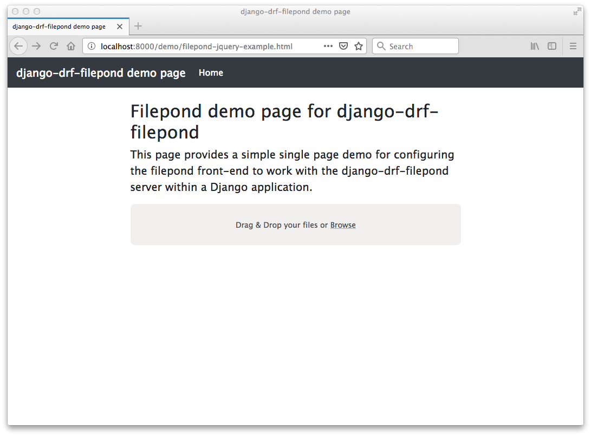

Tutorial
========

This tutorial will walk you through the process of creating a basic 
Django application that provides server-side functionality for 
`filepond <https://pqina.nl/filepond/>`_ using the `django-drf-filepond <https://github.com/ImperialCollegeLondon/django-drf-filepond>`_ app.

A simple demo web page `filepond-jquery-example.html <https://github.com/ImperialCollegeLondon/django-drf-filepond/blob/master/docs/tutorial/filepond-jquery-example.html>`_ is provided for 
you to use as a test front-end for the demo Django application built in 
this tutorial. The web page uses filepond's jQuery adapter, loaded from a 
CDN, and is based on the `Bootstrap <https://getbootstrap.com/>`_ library's 
`starter template <https://getbootstrap.com/docs/4.1/examples/starter-template/>`_.

*NOTE: This tutorial assumes that you are using Python 3 and have* `virtualenv <https://virtualenv.pypa.io/en/latest/>`_ *installed*

The tutorial will walk you through the following steps:

  1. Set up your environment - prepare an environment in which to undertake the tutorial
  2. Creating the Django application - create a simple django application configured to include the django-drf-filepond app
  3. Add the front-end demo web page
  4. Test the service

1. Set up your environment
---------------------------

Create a directory in which to undertake this tutorial. For example, in 
your home directory, create the directory ``drf-filepond-tutorial``

We'll refer to this directory as ``${TUTORIAL_DIR}`` throughout the rest 
of the tutorial. If you're using a Linux or Mac OS platform with a bash 
shell (or a Windows-based environment that provides a bash shell such as 
`WSL <https://docs.microsoft.com/en-us/windows/wsl>`_) you can set the 
environment variable ``TUTORIAL_DIR`` to point the tutorial directory, for
example:

.. prompt:: bash
	
	export TUTORIAL_DIR=${HOME}/drf-filepond-tutorial

In ``${TUTORIAL_DIR}``, create a file named ``requirements.txt`` containing 
the following content::

	Django>=1.11
	django-drf-filepond

Now create a *virtualenv* in ``${TUTORIAL_DIR}``:

.. prompt:: bash

	virtualenv --prompt=drf-filepond-tutorial env
	source env/bin/activate

Your shell prompt should now have been modified to show 
``[drf-filepond-tutorial]`` which shows that you're within the virtual 
environment.

You can now install the dependencies:

.. prompt:: bash
	
	pip install -r requirements.txt

Creating the Django application
-------------------------------

In ``${TUTORIAL_DIR}`` with the virtualenv created in step 1 activated,
use the *django-admin* command to create a new django project:

.. prompt:: bash
	
	django-admin startproject drf_filepond_tutorial .

You should now see a ``manage.py`` file in your current directory as well as 
a ``drf_filepond_tutorial`` directory containing some Python source files.

As described in the Configuration section of the django-drf-filepond 
documentation, we'll now add the django-drf-filepond app to our Django 
project and then create the database to support this app and other default  
functionality within the Django project.

Open the file ``${TUTORIAL_DIR}/drf_filepond_tutorial/settings.py`` in an 
editor.

At the end of the ``INSTALLED_APPS`` section, add ``'django_drf_filepond'``::

	INSTALLED_APPS = [
		...
	    'django.contrib.staticfiles',
	    'django_drf_filepond',
	]

At the end of the file add a new configuration parameter::

	DJANGO_DRF_FILEPOND_UPLOAD_TMP = os.path.join(BASE_DIR, 'filepond-temp-uploads')

Save and close the ``settings.py`` file. 

Now open the ``${TUTORIAL_DIR}/drf_filepond_tutorial/urls.py`` file.

After the two existing import statements, add a new import statement::

	from django.conf.urls import url, include
	
There should now be three import statements at the top of the ``urls.py`` 
file.

To the ``urlpatterns`` list, add an additional entry to link in the filepond 
server URLs such that the ``urlpatterns`` now look as follows::

	urlpatterns = [
    	    path('admin/', admin.site.urls),
    	    url(r'^fp/', include('django_drf_filepond.urls')),
	]

You can now create the database by running:

.. prompt:: bash
	
	python manage.py migrate

3. Add the front-end demo web page
----------------------------------

We now have a very basic, but fully-configured Django project that will act 
as a server for filepond. In order to test this, we need a filepond client.

The `filepond-jquery-example.html <https://github.com/ImperialCollegeLondon/django-drf-filepond/blob/master/docs/tutorial/filepond-jquery-example.html>`_ 
file in the ``docs/tutorial/`` directory of the `django-drf-filepond GitHub repository <https://github.com/ImperialCollegeLondon/django-drf-filepond>`_ 
provides a simple single-page filepond client using filepond's `jQuery adapter <https://github.com/pqina/jquery-filepond>`_.

We can now set up our Django project to serve this HTML file as a static 
file and use it to test the server-side filepond support.

**NOTE: This approach uses Django's** `static file serving support <https://docs.djangoproject.com/en/2.1/howto/static-files/#serving-static-files-during-development>`_ **and it should not be used for production deployment.** 

Create a directory called ``static`` in ${TUTORIAL_DIR}.

Place the ``filepond-jquery-example.html`` file in this directory.

Now open the ``${TUTORIAL_DIR}/drf_filepond_tutorial/urls.py`` file for 
editing. We'll add a new URL mapping to allow access to static files placed 
into the ``${TUTORIAL_DIR}/static/``. Add the following entry to the 
``urlpatterns`` list::

	url(r'^demo/(?P<path>.*)$', serve, {'document_root': os.path.join(settings.BASE_DIR,'static')}),

You will also need to add 3 new import statements to the set of existing 
import statements::

	import os
	from django.views.static import serve
	from django.conf import settings

4. Test the service
-------------------

You are now in a position to test the project that you've set up.

In the ``${TUTORIAL_DIR}`` directory, with the virtualenv that was created 
in step 1 activated, start the Django development server:

.. prompt:: bash

	python manage.py runserver

If there are any errors with your configuration, these will be shown in the 
terminal when you attempt to start the development server.

You should now be able to open the demo page in your browser. Point the 
browser to http://localhost:8000/demo/filepond-jquery-example.html and you 
should see the demo page shown in the figure below:

You can also test programmatically uploading a file from a remote URL. You 
can use your browser's developer console while on the django-drf-filepond 
demo page to call the filepond object's `addFile method <https://pqina.nl/filepond/docs/patterns/api/filepond-instance/#methods>`_ 
to get filepond to retrieve the file and add it. Place a test text file with 
some content in it into the ``${TUTORIAL_DIR}/static/`` directory. Call the 
file ``test.txt``.

In your browser console, enter the following JavaScript code:

.. code-block:: javascript

	testFile = null;
	result = $('.pond').filepond('addFile', 'http://localhost:8000/demo/test.txt').then(
		function(file) { testFile = file; }
	);
	
You will now see that the value of ``testFile.serverId`` contains the ID 
generated for the upload from the URL. The file upload should have appeared 
in the filepond panel in the webpage and it can be cancelled by clicking the 
cancel button in the UI in the same way as a file uploaded from the local 
system by browsing or drag and drop.
