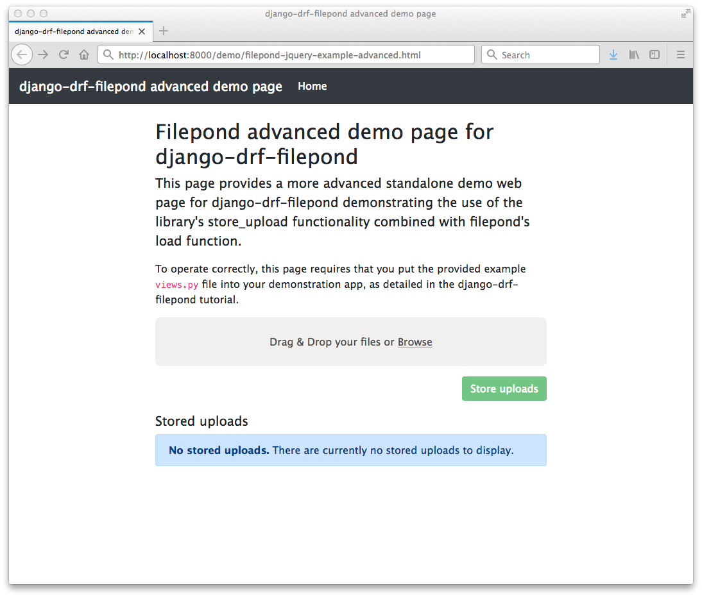

Tutorial
===========

This tutorial will walk you through the process of creating a basic 
Django application that provides server-side functionality for 
`filepond <https://pqina.nl/filepond/>`_ using the `django-drf-filepond <https://github.com/ImperialCollegeLondon/django-drf-filepond>`_ app. 

A simple demo web page `filepond-jquery-example.html <https://github.com/ImperialCollegeLondon/django-drf-filepond/blob/master/docs/tutorial/filepond-jquery-example.html>`_ is provided for 
you to use as a test front-end for the demo Django application built in 
this tutorial. The web page uses filepond's jQuery adapter, loaded from a 
CDN, and is based on the `Bootstrap <https://getbootstrap.com/>`_ library's 
`starter template <https://getbootstrap.com/docs/4.1/examples/starter-template/>`_.

.. note:: This tutorial is in two parts:

	**Part A** focuses on setting up a simple Django application to demonstrate
	basic use of *django-drf-filepond*. It uses local file storage
	(via some form of locally mounted storage on the host computer)
	for temporary uploads and stored files. 
	
	**Part B**, an advanced section at the end of the tutorial details the
	use of the remote file storage capabilities provided by
	*django-drf-filepond* via integration with the *django-storages* library.   

.. warning:: The example given in this tutorial is purely to demonstrate how
	to use the *django-drf-filepond* API and to help you get started with
	using the library's features.
	
	The example application built here does not address security aspects of
	using either local or remote file storage and you should pay particular
	care to this when building your own applications using *django-drf-filepond*.
	
	For example, when using the *django-storages* S3 backend (see tutorial
	section B2), a number of parameters are provided to help configure
	security of the uploaded files and the bucket used for file storage. 
	You should, for example, look at the various ACL options provided in the
	`django-storages S3 documentation <https://django-storages.readthedocs.io/en/latest/backends/amazon-S3.html>`_.

Tutorial Part A: Building a basic Django application that uses django-drf-filepond
^^^^^^^^^^^^^^^^^^^^^^^^^^^^^^^^^^^^^^^^^^^^^^^^^^^^^^^^^^^^^^^^^^^^^^^^^^^^^^^^^^^ 

.. note:: **This tutorial assumes that you are using Python 3 and have** 
	`virtualenv <https://virtualenv.pypa.io/en/latest/>`_ **installed**

The tutorial will walk you through the following steps:

  1. Set up your environment - prepare an environment in which to undertake the tutorial
  2. Creating the Django application - create a simple django application configured to include the django-drf-filepond app
  3. Add the front-end demo web page
  4. Test the service

A1. Set up your environment
---------------------------

Create a directory in which to undertake this tutorial. For example, in 
your home directory, create the directory ``drf-filepond-tutorial``

We'll refer to this directory as ``${TUTORIAL_DIR}`` throughout the rest 
of the tutorial. If you're using a Linux or Mac OS platform with a bash 
shell (or a Windows-based environment that provides a bash shell such as 
`WSL <https://docs.microsoft.com/en-us/windows/wsl>`_ or the Git BASH shell
provided with `Git for Windows <https://gitforwindows.org/>`_) you can set 
the environment variable ``TUTORIAL_DIR`` to point the tutorial directory,
for example:

.. prompt:: bash
	
	export TUTORIAL_DIR=${HOME}/drf-filepond-tutorial

In ``${TUTORIAL_DIR}``, create a file named ``requirements.txt`` containing 
the following content::

	Django>=1.11
	django-drf-filepond

Now create a *virtualenv* in ``${TUTORIAL_DIR}``:

.. prompt:: bash

	virtualenv --prompt=drf-filepond-tutorial env
	source env/bin/activate

Your shell prompt should now have been modified to show 
``[drf-filepond-tutorial]`` which shows that you're within the virtual 
environment.

You can now install the dependencies:

.. prompt:: bash
	
	pip install -r requirements.txt

A2: Creating the Django application
-----------------------------------

In ``${TUTORIAL_DIR}`` with the virtualenv created in step 1 activated,
use the *django-admin* command to create a new django project:

.. prompt:: bash
	
	django-admin startproject drf_filepond_tutorial .

You should now see a ``manage.py`` file in your current directory as well as 
a ``drf_filepond_tutorial`` directory containing some Python source files.

As described in the Configuration section of the django-drf-filepond 
documentation, we'll now add the django-drf-filepond app to our Django 
project and then create the database to support this app and other default  
functionality within the Django project.

Open the file ``${TUTORIAL_DIR}/drf_filepond_tutorial/settings.py`` in an 
editor.

At the end of the ``INSTALLED_APPS`` section, add ``'django_drf_filepond'``::

	INSTALLED_APPS = [
		...
	    'django.contrib.staticfiles',
	    'django_drf_filepond',
	]

At the end of the file add a new configuration parameter::

	DJANGO_DRF_FILEPOND_UPLOAD_TMP = os.path.join(BASE_DIR, 'filepond-temp-uploads')

Save and close the ``settings.py`` file. 

Now open the ``${TUTORIAL_DIR}/drf_filepond_tutorial/urls.py`` file.

After the two existing import statements, add a new import statement::

	from django.conf.urls import url, include
	
There should now be three import statements at the top of the ``urls.py`` 
file.

To the ``urlpatterns`` list, add an additional entry to link in the filepond 
server URLs such that the ``urlpatterns`` now look as follows::

	urlpatterns = [
    	    path('admin/', admin.site.urls),
    	    url(r'^fp/', include('django_drf_filepond.urls')),
	]

You can now create the database by running:

.. prompt:: bash
	
	python manage.py migrate

A3. Add the front-end demo web page
-----------------------------------

We now have a very basic, but fully-configured Django project that will act 
as a server for filepond. In order to test this, we need a filepond client.

The `filepond-jquery-example.html <https://github.com/ImperialCollegeLondon/django-drf-filepond/blob/master/docs/tutorial/filepond-jquery-example.html>`_ 
file in the ``docs/tutorial/`` directory of the `django-drf-filepond GitHub repository <https://github.com/ImperialCollegeLondon/django-drf-filepond>`_ 
provides a simple single-page filepond client using filepond's `jQuery adapter <https://github.com/pqina/jquery-filepond>`_.

We can now set up our Django project to serve this HTML file as a static 
file and use it to test the server-side filepond support.

**NOTE: This approach uses Django's** `static file serving support <https://docs.djangoproject.com/en/2.1/howto/static-files/#serving-static-files-during-development>`_ **and it should not be used for production deployment.** 

Create a directory called ``static`` in ${TUTORIAL_DIR}.

Place the ``filepond-jquery-example.html`` file in this directory.

Now open the ``${TUTORIAL_DIR}/drf_filepond_tutorial/urls.py`` file for 
editing. We'll add a new URL mapping to allow access to static files placed 
into the ``${TUTORIAL_DIR}/static/``. Add the following entry to the 
``urlpatterns`` list::

	url(r'^demo/(?P<path>.*)$', serve, {'document_root': os.path.join(settings.BASE_DIR,'static')}),

You will also need to add 3 new import statements to the set of existing 
import statements::

	import os
	from django.views.static import serve
	from django.conf import settings

A4. Test the service
--------------------

You are now in a position to test the project that you've set up.

In the ``${TUTORIAL_DIR}`` directory, with the virtualenv that was created 
in step 1 activated, start the Django development server:

.. prompt:: bash

	python manage.py runserver

If there are any errors with your configuration, these will be shown in the 
terminal when you attempt to start the development server.

You should now be able to open the demo page in your browser. Point the 
browser to http://localhost:8000/demo/filepond-jquery-example.html and you 
should see the demo page shown in the figure below:

.. image:: images/filepond-demo-page.png

You can now try uploading a file to the server. Drag and drop a file onto
the grey filepond panel on the web page or click *Browse* and select a file.
The file should be uploaded successfully. If you look in the 
``${TUTORIAL_DIR}/filepond-temp-uploads`` directory, the directory we set as
the temporary upload directory using the ``DJANGO_DRF_FILEPOND_UPLOAD_TMP``
parameter in part A2 above, you will see that the file has been uploaded to
this location and placed in a directory named using a unique ID. The file is
also saved using a unique ID to replace it's original filename, which is
preserved in the database. If you click the 'X' icon for the uploaded file
that appears alongside the "Upload complete" message, the temporary upload
is cancelled and you should be able to verify that the file has now
disappeared from the ``${TUTORIAL_DIR}/filepond-temp-uploads`` directory. 

You can also test programmatically uploading a file from a remote URL. You 
can use your browser's developer console while on the django-drf-filepond 
demo page to call the filepond object's `addFile method <https://pqina.nl/filepond/docs/patterns/api/filepond-instance/#methods>`_ 
to get filepond to retrieve the file and add it. Place a test text file with 
some content in it into the ``${TUTORIAL_DIR}/static/`` directory. Call the 
file ``test.txt``.

In your browser console, enter the following JavaScript code:

.. code-block:: javascript

	testFile = null;
	result = $('.pond').filepond('addFile', 'http://localhost:8000/demo/test.txt').then(
		function(file) { testFile = file; }
	);
	
You will now see that the value of ``testFile.serverId`` contains the ID 
generated for the upload from the URL. The file upload should have appeared 
in the filepond panel in the webpage and it can be cancelled by clicking the 
cancel button in the UI in the same way as a file uploaded from the local 
system by browsing or drag and drop.

Tutorial Part B: Using remote file storage
^^^^^^^^^^^^^^^^^^^^^^^^^^^^^^^^^^^^^^^^^^^^

*django-drf-filepond*'s remote file storage functionality enables you to place stored
uploads on a remote file store. You can then use filepond's
`load endpoint <https://pqina.nl/filepond/docs/patterns/api/server/#load>`_ 
to load a stored file directly from the remote storage. You can make use
of any of the `storage backends supported by django-storages <https://django-storages.readthedocs.io/en/latest/>`_.
This includes, for example, `Amazon S3 <https://aws.amazon.com/s3/>`_ or 
`Azure Storage <https://azure.microsoft.com/en-gb/services/storage/>`_.

.. note:: Remote storage is currently only supported for stored uploads.
	Temporary uploads are still stored locally in the location defined by
	the ``DJANGO_DRF_FILEPOND_UPLOAD_TMP`` parameter in your Django
	application's settings.
	
	It is planned to add remote storage for temporary uploads in a future
	release.

This section of the tutorial assumes that you have completed part A and
builds on the Django application developed there.
To support this part of the tutorial, a separate demo HTML page is provided.
This HTML file (`filepond-jquery-example-advanced.html <https://github.com/ImperialCollegeLondon/django-drf-filepond/blob/master/docs/tutorial/filepond-jquery-example-advanced.html>`_)
includes a more advanced design to demonstrate the storage and retrieval of
uploads and also the removal of stored uploads.

.. note:: Not all features detailed here are supported on all *django-storages*
	backends. Support depends directly on whether *django-storages* provides
	support for a given feature. For example, if *django-storages* doesn't
	support file deletion for a particular storage backend,
	*django-drf-filepond* will not support file deletion for that platform.

B1. Add a new web interface and REST endpoint to the demo app
--------------------------------------------------------------

Part B of the tutorial begins with updating the demo application that you set up in part A
with a new HTML page, `filepond-jquery-example-advanced.html <https://github.com/ImperialCollegeLondon/django-drf-filepond/blob/master/docs/tutorial/filepond-jquery-example-advanced.html>`_,
that contains a more advanced interface with additional functionality.
Obtain the HTML file `directly from GitHub <https://raw.githubusercontent.com/ImperialCollegeLondon/django-drf-filepond/master/docs/tutorial/filepond-jquery-example-advanced.html>`_
or copy it from your clone of the *django-drf-filepond* repository into the 
``${TUTORIAL_DIR}/static/`` directory.
 
As demonstrated in part A of the tutorial, the initial upload of a file, 
where it is uploaded to the server as a temporary upload and shown in green
within the filepond component, is handled directly by the filepond 
`server API <https://pqina.nl/filepond/docs/patterns/api/server/>`_
as implemented by *django-drf-filepond*. In the case of the temporary
upload, this is handled by the ``process`` endpoint. After one or more
files have been uploaded, when the form containing the filepond component is
submitted, this must be handled by your application rather than by 
*django-drf-filepond*. In the case of this tutorial, the 
*drf-filepond-tutorial* app needs to handle the submission of the form that
triggers the permanent storage of the file upload. 

``filepond-jquery-example-advanced.html`` contains an HTML form in which the
filepond component is embedded. Clicking the "Store uploads" button triggers
submission of the form. This form submission is handled by a view in the
*drf_filepond_tutorial* app. In part A of the tutorial, there were no views
within the *drf_filepond_tutorial* app itself. File uploads were handled by
the views provided by *django-drf-filepond*. We now need a view in
the *drf_filepond_tutorial* app to handle the form submission. A ``views.py``
file containing the implementation of a view class to handle requests from the
web page is provided in the ``docs/tutorial`` directory of the *django-drf-filepond*
repository.

Copy ``docs/tutorial/views.py`` from your clone of the *django-drf-filepond*
repository and place it in ``${TUTORIAL_DIR}/drf_filepond_tutorial/``.

Alternatively, download `views.py directly from GitHub <https://raw.githubusercontent.com/ImperialCollegeLondon/django-drf-filepond/master/docs/tutorial/views.py>`_
and place it in the ``${TUTORIAL_DIR}/drf_filepond_tutorial/`` directory.

It is now necessary to modify ``${TUTORIAL_DIR}/drf_filepond_tutorial/urls.py``
to link an endpoint URL to the form processing view in ``views.py``. Add the 
following entry to the ``urlpatterns`` list in ``urls.py``:

.. code-block:: python

			url(r'^submitForm/$', views.SubmitFormView.as_view(), name='submit_form'),

and add the following additional import statement below the existing import
statements towards the top of the top of the ``urls.py`` file: 

.. code-block:: python

			from drf_filepond_tutorial import views

This will ensure that all incoming requests to the ``/submitForm/`` URL are
handled by the ``SubmitFormView`` class in the ``views.py`` file that you
just added.

B2. Configure your storage backend
-----------------------------------

A Django class-based view is now in place that will handle calling the *django-drf-filepond*
API to store a temporary upload to remote storage. However, at this stage
we don't have any configuration in place to tell *django-drf-filepond* which
storage backend to use and the settings for communicating with that backend
and authenticating with it. 

The storage backends provided by *django-storages* each include a number of
configuration options. This includes a way to define the base location on
the remote storage platform where files should be stored.

.. note:: If you have extended your demo app from part A before starting
	this part of the tutorial and have added the
	``DJANGO_DRF_FILEPOND_FILE_STORE_PATH`` setting into your 
	``${TUTORIAL_DIR}/drf_filepond_tutorial/settings.py`` file, you should
	set it to ``None`` or remove it altogether from the settings file since
	this parameter is not used for remote file storage. 

We'll now add some storage backend settings to ``settings.py``.
For the example here, we'll use the Amazon S3 storage backend in *django-storages*
to talk to the open source, Amazon S3-compatible `MinIO <https://min.io/>`_
storage service. You can download and run MinIO within a docker container
on your local system or you can use the same approach detailed here to target
Amazon S3 directly.

To begin with, it will be necessary to add additional dependencies required
by *django-storages*. The basic *django-storages* library is a required
dependency of *django-drf-filepond* but different storage backends may have
additional dependencies that need to be installed. These additional dependencies
can be installed using the ``pip`` package manager. For details of any
additional dependencies required by a given backend you can look in the
``extras_require`` section of the `django-storages setup.py file <https://github.com/jschneier/django-storages/blob/master/setup.py>`_.
This shows, for example, that the ``sftp`` backend requires the ``paramiko``
library. `boto3 <https://boto3.amazonaws.com/v1/documentation/api/latest/index.html>`_ 
is the library used for accessing Amazon Web Services and we'll require ``boto3``
to be installed to use the Amazon S3 storage backend in this example.

Ensuring that you have first activated the Python virtualenv virtual
environment (set up in section A1 of the tutorial) in your terminal, install
``boto3`` as follows:

.. prompt:: bash

	pip install boto3

The *django-storages* `documentation for the Amazon S3 backend <https://django-storages.readthedocs.io/en/latest/backends/amazon-S3.html>`_ 
details the various configuration settings that are available.

*django-drf-filepond* requires that, for a remote storage backend, you set
the ``DJANGO_DRF_FILEPOND_STORAGES_BACKEND`` parameter in your ``settings.py``
file. The value to use for this parameter is the same as value shown in the *django-storages*
documentation for the *DEFAULT_FILE_STORAGE* setting for a given storage backend. For
example, for the Amazon S3 backend, this would be ``'storages.backends.s3boto3.S3Boto3Storage'``.
For Azure Storage, the value would be ``'storages.backends.azure_storage.AzureStorage'``.
Set the parameter in your *drf-filepond-tutorial* ``${TUTORIAL_DIR}/drf_filepond_tutorial/settings.py``
file as follows:

.. code-block:: python

	DJANGO_DRF_FILEPOND_STORAGES_BACKEND = 'storages.backends.s3boto3.S3Boto3Storage'

You now need to add a number of *django-storages*-specific parameters to
configure the S3 backend. For targeting a local MinIO deployment, running
over SSL with a valid SSL server certificate, we use the following parameters
(note that you'll need to modify some of the values to match your own MinIO
or S3 settings):

.. code-block:: python

	AWS_ACCESS_KEY_ID = '<Your MinIO access key>'
	AWS_SECRET_ACCESS_KEY = '<Your MinIO secret key>'
	AWS_STORAGE_BUCKET_NAME = 'drf-filepond-tutorial'
	AWS_AUTO_CREATE_BUCKET = True
	AWS_S3_ENDPOINT_URL = 'https://myminio.local:9000'

With this configuration, when you first attempt to store a temporary upload,
a bucket named *drf-filepond-tutorial* will be created in MinIO, if it is not
already present, and your stored upload will be placed in that bucket, prefixed
with any relative path location provided in the code that stores the upload.

If you wish to target Amazon S3 directly, a couple of changes to the above
settings will be required, the following set of settings will allow you to
store uploads to S3:

.. code-block:: python

	AWS_ACCESS_KEY_ID = '<Your AWS access key>'
	AWS_SECRET_ACCESS_KEY = '<Your AWS secret key>'
	AWS_STORAGE_BUCKET_NAME = 'drf-filepond-tutorial'
	AWS_AUTO_CREATE_BUCKET = True
	AWS_S3_REGION_NAME = 'eu-west-1' # Set to your chosen storage region

As mentioned above, you can find the full set of available S3 configuration
options in the `django-storages S3 documentation <https://django-storages.readthedocs.io/en/latest/backends/amazon-S3.html>`_.

.. warning:: Avoid storing your AWS/MinIO credentials directly in your
	configuration file. Be very careful to ensure that your settings
	file containing private credentials is not unintentionally committed to
	a code repository, especially a public repository!
	
	There are various options for avoiding placing credentials directly in
	configuration files and many discussions online of methods. This `blog
	post <https://medium.com/poka-techblog/the-best-way-to-store-secrets-in-your-app-is-not-to-store-secrets-in-your-app-308a6807d3ed>`_
	provides some useful examples and ideas.

B3: Testing the updated service
--------------------------------
Ensure that you have an open terminal in which you have activated the Python
virtual environment that you created in tutorial section A1.

If you have stopped the Django development server that was started in part A
of the tutorial, you should restart it now by running the following in a shell
in the ``${TUTORIAL_DIR}`` directory:

.. prompt:: bash

	python manage.py runserver

Assuming that the server starts successfully and there are no errors, you
should now be able to open the advanced demo page in your browser. Point
the browser to `http://localhost:8000/demo/filepond-jquery-example-advanced.html <http://localhost:8000/demo/filepond-jquery-example-advanced.html>`_
and you should see the advanced demo page shown in the figure below:

Drag and drop a file onto the grey filepond component panel or click *Browse*
to select a file to upload. It is recommended that you add a png or jpeg
image file with the extension ``.png`` or ``.jpg`` for the purpose of the
example in this tutorial. The file should upload successfully and the
*Store uploads* button should become active.

If you now click the *Store uploads* button, this will make a request
(containing one or more unique IDs representing the filepond temporary
upload(s)) to the web application's `/submitForm` URL and this will then be
handled by the relevant function in the view class defined in the `views.py`
file that you added to the application in section B1.

Assuming that your configuration is correct and the request is successful,
you should then see the file you uploaded appear in the *Stored uploads*
section of the page. If you uploaded a png or jpeg image file, the demo page
will make a request to the *django-drf-filepond* `load` endpoint to retrieve
the file from the remote storage platform and display it as a preview. If
you see the image displayed, then your link to the remote storage platform
is fully operational.

You can verify this by using MinIO or S3's web-based console to check that
the file you stored has been correctly uploaded to the remote platform.

If you now click the *Delete stored upload* button, this will DELETE THE FILE
from the remote storage platform. You should now be able to verify that the
file has been removed from the remote storage platform.

.. note:: There is a known issue with file deletion on storage platforms
	 that are based on a standard filesystem, for example *django-storages*
	 SFTP backend.
	 
	 When a file is deleted, using the API, the file itself is removed but
	 any directories created to store the file at the full path specified
	 when storing the file are left in place. This was a design decision
	 since there is currently no way to know exactly which directories were
	 created when the upload was stored so removing an arbitrary set of
	 directories on a remote filesystem was not considered a reasonable
	 approach. 
	 
	 If there is demand for use of the SFTP backend, there is scope to store
	 in the database details of created directories and then remove these if
	 they're empty when a file is removed. 

This completes the advanced section of the *django-drf-filepond* tutorial.
If you require assistance with using the *django-drf-filepond* API to store
files to a remote storage backend, take a look at the code in the `example 
views.py file <https://github.com/ImperialCollegeLondon/django-drf-filepond/blob/master/docs/tutorial/views.py>`_ 
provided with the tutorial.